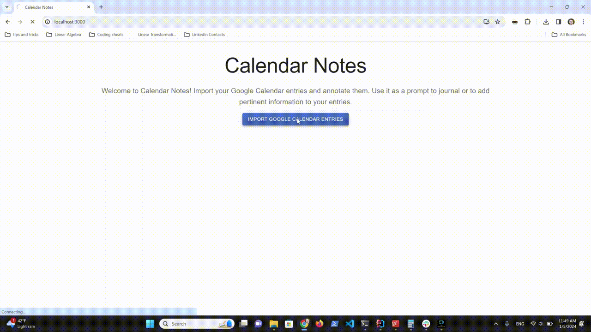

### Calendar Notes

I wanted to build Calendar Notes with a dual purpose in mind. 

First, I wanted to learn new tools and libraries. So far I've learnt some React with Material UI, GoogleAuth and 
Google Calendar API. As I continue building out the app, I expect that I will introduce new tools and libraries.

Second, I wanted to start building a journaling application that I will actually use in the future. As someone who keeps my calendar up-to-date and likes 
to journal, I want to be able to review my events for the last week or two and associate journal entries to these 
events. I also want to be able to export these calendar entries in an open-source format, which in this case will be 
md files.

### To-do

* Download an individual entry
* Bulk download all entries
* Introduce MD editor 

### Preview

Current functionality entails:
* A React front end and Node.js back end
* Authenticating with an existing Google Account to export calendar entries for the last 2 weeks
* Saving exported entries in the server as `md` files and displaying them on the front end
* Adding a note to each entry on the front end
* Clicking "Save" to persist the changes to the entry to the back end `md` file

